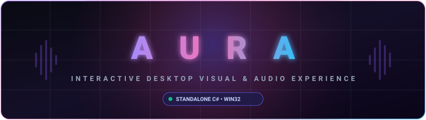

<div align="center">

  

  <br><br>

  [](https://github.com/shisno2/AURA/releases/latest)
  [](https://microsoft.com/windows)
  [](https://dotnet.microsoft.com/)
  [](LICENSE)

  <br>

  <p align="center">
    <strong>Интерактивное аудиовизуальное приложение для Windows с эффектами рабочего стола, динамическими обоями и звуковой синхронизацией.</strong>
    <br>
    <em>An interactive desktop audiovisual experience and prank utility built entirely in native C# with Win32 APIs.</em>
  </p>

  <p align="center">
    <a href="https://github.com/shisno2/AURA/releases/latest/download/AURA.exe">
      
    </a>
    &nbsp;
    <a href="https://github.com/shisno2/AURA/releases/latest/download/AURA_Lite.exe">
      
    </a>
  </p>

</div>

---

## ⚡ О проекте / Overview

**AURA** — интерактивное портативное приложение на C#, использующее низкоуровневые вызовы Windows API (`user32.dll`, `shell32.dll`, `kernel32.dll`) для воспроизведения синхронизированного аудиовизуального перформанса прямо на экране пользователя.

### 🎭 Доступные редакции:
- **AURA.exe (Full)**: Включает все эффекты — смену обоев рабочего стола, генерацию файлов `.txt`, фоновую музыку, блокировку панели задач, стартовую ошибку, полноэкранный анимированный скример с быстрой сменой лиц Trollface и каскад диалоговых окон с текстом песни.
- **AURA_Lite.exe (Lite / Safe)**: Облегченная версия — **НЕ** меняет обои, **НЕ** создает файлы на рабочем столе и **НЕ** блокирует панель задач. Оставляет только визуальные эффекты: синхронизированную музыку, стартовую ошибку, каскад диалоговых окон и анимированный скример.

---

## ✨ Ключевые возможности / Features

| Компонент | Full | Lite | Описание |
| :--- | :---: | :---: | :--- |
| 🎵 **Аудио-драйвер** | ✅ | ✅ | Фоновое воспроизведение встроенного трека без зависаний. |
| 🖼️ **Смена обоев** | ✅ | ❌ | Плавная смена обоев с автовосстановлением исходных при закрытии. |
| 📁 **Заполнение стола** | ✅ | ❌ | Заполнение рабочего стола файлами `.txt` с автообновлением проводника. |
| 💬 **Стартовая ошибка** | ✅ | ✅ | Первое окно с текстом «ну всё пк 200» по центру экрана, живёт 3 секунды. |
| 👁️ **Анимированный скример**| ✅ | ✅ | Полноэкранный скример сразу после стартовой ошибки, с быстрой сменой лиц Trollface. |
| 🪟 **Каскад текстов** | ✅ | ✅ | Всплывающие диалоги с текстом песни, синхронизированные по таймингам. |
| 🔒 **Блокировка панели задач** | ✅ | ❌ | Панель задач скрывается до конца сеанса и автоматически возвращается. |
| 🛡️ **Портативность** | ✅ | ✅ | Один `.exe`, все ресурсы внутри, запуск без установки и прав администратора. |

> [!NOTE]
> Одновременно на экране отображается не более **4** окон-ошибок: при появлении нового самое старое закрывается автоматически.

---

## 🎬 Сценарий запуска / Run Sequence

1. Приложение полностью разворачивается и прогревается (обои, музыка, ресурсы).
2. По центру экрана появляется ошибка **«ну всё пк 200»** и висит ровно **3 секунды**.
3. Сразу после неё — полноэкранный троллфейс.
4. Далее начинается каскад окон-ошибок с текстом песни (максимум 4 одновременно).
5. В конце сеанса панель задач возвращается, обои восстанавливаются.

---

## 🚀 Быстрый старт / Quick Start

### 1. Скачивание готового файла
1. Перейдите во вкладку [**Releases**](https://github.com/shisno2/AURA/releases/latest).
2. Выберите нужную версию:
   - `AURA.exe` — полная версия.
   - `AURA_Lite.exe` — облегченная версия (без обоев, файлов на столе и блокировки панели задач).
3. Запустите файл на Windows 10 или 11.

> [!NOTE]
> Приложение не требует установки дополнительных библиотек или прав администратора.

---

## 🛠️ Сборка из исходников / Build from Source

Проект собирается с помощью встроенного в Windows компилятора `csc.exe` (.NET Framework), поэтому для компиляции не требуется установка Visual Studio или SDK.

1. **Клонируйте репозиторий:**
   ```bash
   git clone https://github.com/shisno2/AURA.git
   cd AURA
   ```

2. **Запустите скрипт сборки:**
   ```cmd
   build.bat
   ```
   Скрипт автоматически:
   - Сгенерирует многослойную иконку `aura.ico` через `src/MakeIcon.cs`
   - Скомпилирует `src/Program.cs` со всеми вшитыми ресурсами
   - Создаст оптимизированный релизный `AURA.exe` в корне папки

---

## 📂 Структура репозитория / Repository Structure

```
AURA/
├── .github/
│   └── workflows/
│       └── release.yml     # Автоматическая сборка релизов через GitHub Actions
├── assets/
│   ├── banner.svg          # Векторный баннер проекта
│   └── preview.png         # Графика интерфейса
├── src/
│   ├── Program.cs          # Основной код приложения и логика Win32
│   └── MakeIcon.cs         # Генератор иконки приложения
├── build.bat               # Скрипт сборки через .NET Framework csc.exe
├── LICENSE                 # Лицензия MIT
└── README.md               # Документация проекта
```

---

## 🔒 Безопасность и ложные срабатывания / Antivirus Notice

> [!IMPORTANT]
> Поскольку `AURA.exe` взаимодействует со сменой обоев через системный Win32 API и распространяется в виде одного независимого бинарника без дорогостоящего коммерческого сертификата цифровой подписи (Code Signing Certificate), некоторые антивирусы могут выдавать предупреждения эвристики (Generic / Heuristic False Positives).
> 
> Исходный код **полностью открыт** в папке [`src/`](src/), прозрачен для аудита и может быть свободно проверен и скомпилирован вами лично.

---

## 📜 Лицензия / License

Проект распространяется под лицензией [MIT](LICENSE). Разработано в образовательных и развлекательных целях.
